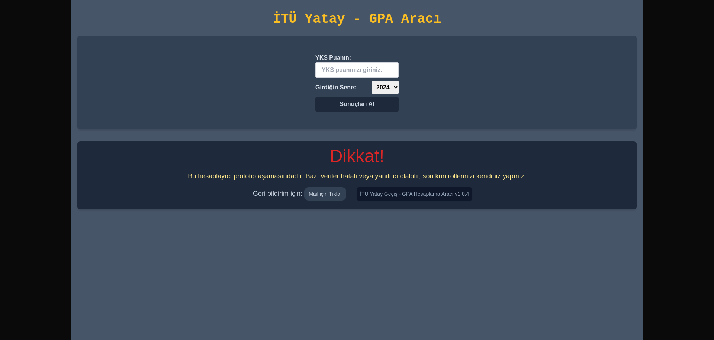

# Bu proje `ITU öğrencileri` için yapılmıştır.

> Dikkat bu site ve program hala **prototip** aşamasındadır!
>
> Eğer sitedeki verilerde bir sorun varsa çoğunlukla bunun **farkındayız.** Düzeltmek için çabalıyoruz.
>
> `Sakin Kalın :)`

## Sitenin amacı nedir?

Site sizin yerleştiğiniz YKS puanınızı kullanarak, `ITU` tarafından 2024-2025 öğretim dönemi için açıklanan verileri sizin puanınızla işler ve kolayca **GPA** değeri olarak görüntülemenizi sağlar.

> Geçici olarak şu an domain: [itu-gpa.vercel.app](https://itu-gpa.vercel.app)

---

> ### Sürüm: v1.0.1

- [x] Sadece ingilizce olan bölümler, filtrelenebiliyor.
- [x] Makina mühendisliği data sorunu düzeltildi.
- [x] Yarıyıllara göre filtreleme
- [ ] Liste son halini aldı.
- [ ] UI/UX Son halini aldı.
